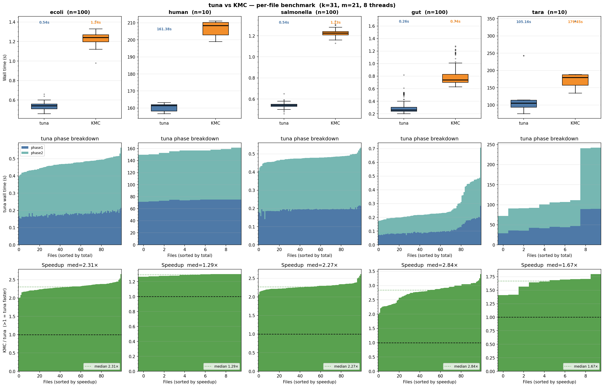

# tuna

**tuna** is a fast, streaming k-mer counter for FASTA/FASTQ input.
It partitions k-mers by minimizer into superkmer files, then counts them using a streaming hash table — keeping memory usage low and throughput high.

It uses [kache-hash](https://github.com/vicLeva/kache-hash) as its streaming k-mer hash table.
Phase 1 parsing uses a C++ port of [helicase](https://github.com/imartayan/helicase) (SIMD FASTA/FASTQ, ~5 GB/s), and minimizer hashing uses a C++ port of [simd-minimizers](https://github.com/Daniel-Liu-c0deb0t/simd-minimizers) (canonical ntHash, two-stack sliding window minimum).

---

## Table of contents

- [How it works](#how-it-works)
- [Dependencies](#dependencies)
- [Installation](#installation)
- [Usage](#usage)
- [Output format](#output-format)
- [Benchmarks](#benchmarks)

---

## How it works

tuna runs a two-phase pipeline:

1. **Partition (Phase 1)** — streams each input file through a minimizer iterator. Whenever the minimizer changes, the current superkmer is flushed to a per-partition binary file (on disk if unsufficient RAM budget). This groups k-mers that share a minimizer into the same bucket. The number of partitions is auto-tuned from input size (targeting ~2 MB input per partition) or set explicitly with `-n`.

2. **Count (Phase 2)** — replays each partition, upserting every k-mer into a Kache-hash table with increment semantics. Each partition is processed independently, so the hash table only ever holds one partition's k-mers at a time.

3. **Output (Phase 2, cont.)** — iterates the table, applies `-ci`/`-cx` count filters, and writes `<kmer>\t<count>` to the output file.

Partitions are processed in parallel across threads (up to `-n` partitions at a time), keeping peak memory proportional to a single partition's k-mer set.

---

## Dependencies

- C++20 compiler: [GCC](https://gcc.gnu.org/) >= 9.1 or [Clang](https://clang.llvm.org) >= 9.0
- [CMake](https://cmake.org/) >= 3.17
- [zlib](https://zlib.net/)

**Debian/Ubuntu:**
```bash
sudo apt-get install build-essential cmake zlib1g-dev
```

**Fedora/RHEL:**
```bash
sudo dnf install gcc-c++ cmake zlib-devel
```

**macOS:**
```bash
brew install llvm cmake zlib
```

---

## Installation

```bash
git clone https://github.com/vicLeva/tuna.git
cd tuna/
mkdir build && cd build/
cmake .. -DCMAKE_BUILD_TYPE=Release
cmake --build . --target tuna -j$(nproc)
```

> **Note:** Always pass `-DCMAKE_BUILD_TYPE=Release` explicitly. If a stale `CMakeCache.txt` exists in the build directory from a previous Debug configuration, plain `cmake ..` will reuse the cached build type and produce an unoptimized binary (~6× slower).

The `tuna` binary will be at `build/tuna`.

### Cluster / conda environments

If you see a linker error like `undefined reference to 'memcpy@GLIBC_2.14'`, your environment's `libz.so` was compiled against a newer glibc than the system provides (common with conda or spack on HPC clusters).
CMake will automatically fall back to static `libz.a`, which avoids the issue — so deleting your `build/` directory and rebuilding from scratch should resolve it.

### Optional compile-time flags

| Flag | Default | Description |
|------|---------|-------------|
| `-DINSTANCE_COUNT=N` | 32 | Number of k values instantiated at compile time |
| `-DFIXED_K=N` | — | Compile for a single k value only (smaller binary) |

---

## Usage

```
tuna [options] <input1.fa [input2.fa ...]> <output_file>
tuna [options] @<input_list_file>          <output_file>
```

Input files can be FASTA or FASTQ, plain or gzipped.
Instead of listing files directly, you can pass `@list.txt` where `list.txt` is a newline-separated file of paths.

### Options

| Flag | Argument | Default | Description |
|------|----------|---------|-------------|
| `-k` | `<int>` | `31` | k-mer length. Any odd value in `[11,31]` (fits in 64-bit word) |
| `-m` | `<int>` | `21` | Minimizer length. Any odd value in `[9, k-2]` (must be odd and < k) |
| `-n` | `<int>` | auto | Number of partitions. Auto-tuned to ~2 MB input/partition when omitted |
| `-t` | `<int>` | `1` | Number of threads. Phase 1 parallelises over input files; Phase 2 over partitions |
| `-ci` | `<int>` | `1` | Minimum count to report |
| `-cx` | `<int>` | `max` | Maximum count to report |
| `-w` | `<dir>` | next to output | Working directory for temporary partition files |
| `-hp` | — | off | Hide progress messages (phase timings are always emitted to stderr) |
| `-kt` | — | off | Keep temporary partition files after the run (useful for benchmarking) |
| `-tp` | — | off | Stop after partitioning — Phase 1 only (useful for benchmarking partition speed) |
| `-dbg` | — | off | Debug stats: per-partition table summary + minimizer coverage CSV written to `<work_dir>/debug_min_coverage.csv` |
| `-h` / `--help` | — | — | Print usage |

### Examples

Count k-mers in a reference genome, k=31, 4 threads:

```bash
tuna -k 31 -t 4 genome.fa counts.tsv
```

Count only k-mers seen at least twice:

```bash
tuna -k 31 -t 4 -ci 2 genome.fa counts.tsv
```

Count from a list of files:

```bash
tuna -k 31 -t 8 @genomes.list counts.tsv
```

---

## Output format

Plain text, tab-separated, one k-mer per line:

```
ACGTACGTACGTACGTACGTACGTACGTACG	42
TGCATGCATGCATGCATGCATGCATGCATGC	7
...
```

Only k-mers with counts in `[ci, cx]` are written. The canonical (lexicographically smaller of forward/reverse-complement) form of each k-mer is reported.

---

## Benchmarks

Comparison with [KMC 3.2.4](https://github.com/refresh-bio/KMC), k=31, m=21, 8 threads, on a cluster node (96 MB L3).
Each row shows the **median wall time** over per-file runs (100 files for bacteria/metagenomes, 10 for human and Tara).

| dataset | type | tuna median | KMC median | speedup | tuna p1 | tuna p2 |
|---------|------|-------------|------------|---------|---------|---------|
| *E. coli* | genomes (plain FASTA) | 0.54 s | 1.24 s | **2.3×** | 0.18 s | 0.30 s |
| *Salmonella* | genomes (gz) | 0.54 s | 1.23 s | **2.3×** | 0.20 s | 0.28 s |
| Gut | metagenome assemblies (plain FASTA) | 0.26 s | 0.74 s | **2.9×** | 0.09 s | 0.13 s |
| Human | genomes (gz) | 161 s | 208 s | **1.3×** | 75 s | 82 s |
| Tara | metagenome reads (gz, 5.9 GB) | 105 s | 179 s | **1.7×** | 43 s | 60 s |

tuna is consistently faster than KMC across all dataset types.
Memory usage scales with unique k-mers per partition rather than total input size.  
KMC tends to be faster on scaling set of datasets rather than counting k-mers inside individual files.


